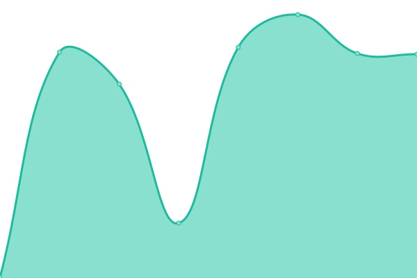

# [📈 Live Status](https://upptime.cacathead.cn): <!--live status--> **🟩 All systems operational**

This repository contains the open-source uptime monitor and status page for [CaCatHead](https://cacathead.cn/), powered by [Upptime](https://github.com/upptime/upptime).

With [Upptime](https://upptime.js.org), you can get your own unlimited and free uptime monitor and status page, powered entirely by a GitHub repository. We use [Issues](https://github.com/CaCatHead/upptime/issues) as incident reports, [Actions](https://github.com/CaCatHead/upptime/actions) as uptime monitors, and [Pages](https://upptime.cacathead.cn) for the status page.

<!--start: status pages-->
<!-- This summary is generated by Upptime (https://github.com/upptime/upptime) -->
<!-- Do not edit this manually, your changes will be overwritten -->
<!-- prettier-ignore -->
| URL | Status | History | Response Time | Uptime |
| --- | ------ | ------- | ------------- | ------ |
|  [CaCatHead](https://cacathead.cn) | 🟩 Up | [ca-cat-head.yml](https://github.com/CaCatHead/upptime/commits/HEAD/history/ca-cat-head.yml) | 

 2248ms
     
 | 

<a href="https://upptime.cacathead.cn/history/ca-cat-head">100.00%</a>
    

|  [XLorPaste OJ](https://oj.xlorpaste.cn) | 🟩 Up | [x-lor-paste-oj.yml](https://github.com/CaCatHead/upptime/commits/HEAD/history/x-lor-paste-oj.yml) | 

 1420ms
     
 | 

<a href="https://upptime.cacathead.cn/history/x-lor-paste-oj">100.00%</a>
    

|  [Docs](https://docs.cacathead.cn) | 🟩 Up | [docs.yml](https://github.com/CaCatHead/upptime/commits/HEAD/history/docs.yml) | 

 256ms
     
 | 

<a href="https://upptime.cacathead.cn/history/docs">100.00%</a>
    

|  [Upptime](https://upptime.cacathead.cn) | 🟩 Up | [upptime.yml](https://github.com/CaCatHead/upptime/commits/HEAD/history/upptime.yml) | 

 233ms
     
 | 

<a href="https://upptime.cacathead.cn/history/upptime">100.00%</a>
    

<!--end: status pages-->

[**Visit our status website →**](https://upptime.cacathead.cn)

## 📄 License

- Powered by: [Upptime](https://github.com/upptime/upptime)
- Code: [MIT](./LICENSE) © [CaCatHead](https://cacathead.cn/)
- Data in the `./history` directory: [Open Database License](https://opendatacommons.org/licenses/odbl/1-0/)
